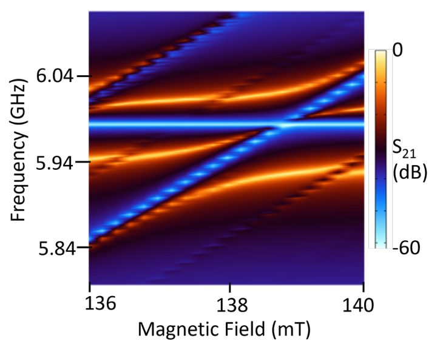
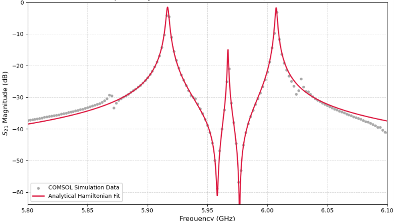

# Analysis of a Tripartite Qubit-Magnon-Cavity System Using COMSOL

This repository contains the COMSOL simulation files, Python analysis, simulation data, and report for the analysis of a tripartite superconducting qubit-magnon-cavity system. The project investigates cavity-qubit coupling, cavity-magnon coupling, and three-mode hybridization using full-wave electromagnetic simulations and analytical input-output theory.


## Repository Structure

* **comsol/** – COMSOL Multiphysics simulation files for the cavity-qubit, cavity-magnon, and tripartite systems.
* **analysis/** – Python notebooks/scripts for analytical modelling, curve fitting, and data analysis.
* **data/** – Simulation data exported from COMSOL and used for plotting and fitting.
* **figures/** – Figures generated from the simulations and analysis.
* **Analysis_of_Tripartite_System.pdf** – Complete project report.

## Workflow

```
COMSOL Multiphysics
        ↓
Cavity-Qubit System
        ↓
Cavity-Magnon System
        ↓
Tripartite System
        ↓
S21 Transmission
        ↓
Three-Mode Analytical Model
        ↓
Curve Fitting
        ↓
Coupling and Loss Extraction
```

## Methods

* Electromagnetic Simulation: COMSOL Multiphysics
* Cavity Analysis: Eigenmode and frequency-domain simulations
* Qubit Model: Lumped inductance representation of the Josephson junction
* Magnon Model: Polder permeability tensor
* Magnon Frequency: Kittel equation
* Analytical Model: Three-mode Hamiltonian
* Transmission Analysis: Collett-Gardiner input-output theory
* Parameter Extraction: Curve fitting of simulated $S_{21}$ spectra

## Cavity-Qubit System

A rectangular microwave cavity with dimensions **40 mm × 10 mm × 32 mm** was simulated. The theoretical $f_{101}$ frequency was approximately **6.002 GHz**, while the bare cavity frequency obtained from COMSOL was **5.9988 GHz**.

A superconducting qubit was placed at the region of maximum electric field and represented using a lumped inductance of **12.3 nH**.

The cavity-qubit coupling strength extracted from the simulated transmission response was approximately **40 MHz**, with a dominant cavity decay rate of **3.35 MHz**.

## Cavity-Magnon System

A **3 mm × 3 mm × 0.1 mm** YIG film was placed at the region of maximum cavity magnetic field. The magnetic response was modelled using the Polder permeability tensor with a Gilbert damping parameter of **$\alpha_G = 0.0001$**.

The external magnetic field was swept from **0.136 T to 0.140 T**, allowing the cavity-magnon avoided crossing to be observed.

The cavity-magnon coupling strength extracted from the simulation was approximately **35 MHz**.

## Tripartite System
The superconducting qubit and YIG film were then integrated into the same microwave cavity. The qubit and magnon were spatially separated so that their direct coupling was negligible, with the cavity acting as the primary interaction channel.
The system was modelled using a three-mode Hamiltonian:

```math
\frac{H_{\mathrm{sys}}}{\hbar}
=
\Delta_c c^\dagger c
+
\Delta_m m^\dagger m
+
\Delta_q q^\dagger q
+
g_{cm}(c^\dagger m + cm^\dagger)
+
g_{cq}(c^\dagger q + cq^\dagger)
+
g_{mq}(m^\dagger q + mq^\dagger)
```

Here, $c$, $m$, and $q$ represent the cavity photon, magnon, and qubit modes, respectively.
The resulting transmission response was calculated using input-output theory and compared with the COMSOL $S_{21}$ spectrum.

## Key Results

At a magnetic field of approximately **138.6 mT**, the cavity, qubit, and magnon modes hybridize and form three distinct spectral branches.

| Parameter              | Value      |
| ---------------------- | ---------- |
| Cavity Frequency       | 5.9563 GHz |
| Magnon Frequency       | 5.9768 GHz |
| Qubit Frequency        | 5.9582 GHz |
| Cavity-Magnon Coupling | 30.87 MHz  |
| Cavity-Qubit Coupling  | 31.28 MHz  |
| Cavity Loss Rate       | 3.442 MHz  |
| Magnon Loss Rate       | 0.352 MHz  |
| Qubit Relaxation Rate  | 1.000 MHz  |

### Tripartite Mode Splitting



The simulated $S_{21}$ transmission spectrum shows three hybridized modes as the external magnetic field is varied. The three branches become clearly resolved around **138.6 mT**.

### Analytical Fit



The three-mode analytical model reproduces the main features of the COMSOL transmission spectrum, including the three hybridized modes and the sharp transmission dips.

The transmission spectrum also exhibits a pronounced antiresonance, with $S_{21}$ reaching nearly **−60 dB**, arising from destructive interference between different excitation pathways in the hybridized system.

## Report

A detailed description of the COMSOL simulations, cavity-qubit and cavity-magnon analysis, tripartite Hamiltonian, input-output model, parameter extraction, and results is available in **Analysis_of_Tripartite_System.pdf**.

## References

1. Y. Tabuchi, S. Ishino, A. Noguchi, T. Ishikawa, R. Yamazaki, K. Usami, and Y. Nakamura, *Quantum magnonics: Magnon meets superconducting qubit*, 2015.
   https://arxiv.org/abs/1508.05290

2. D. M. Pozar, *Microwave Engineering*, 4th ed., John Wiley & Sons, 2011.

3. A. G. Gurevich and A. P. Melkov, *Magnetization Oscillations and Waves*, CRC Press.

4. C. W. Gardiner and M. J. Collett, *Input and output in damped quantum systems: Quantum stochastic differential equations and the master equation*, Physical Review A 31, 3761 (1985).
   https://doi.org/10.1103/PhysRevA.31.3761

```
```
